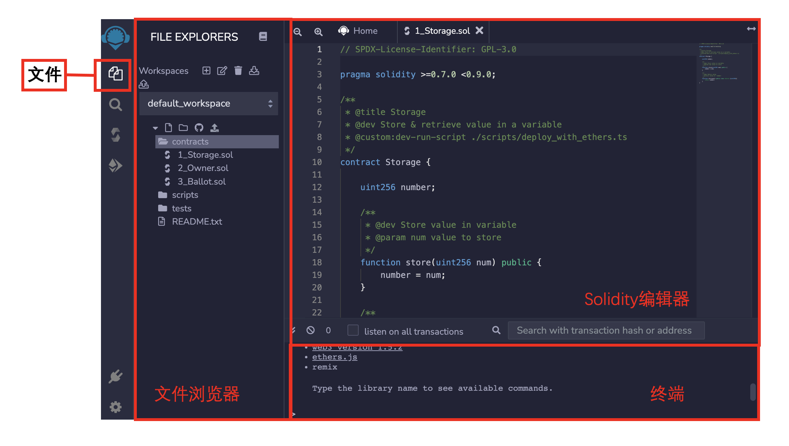
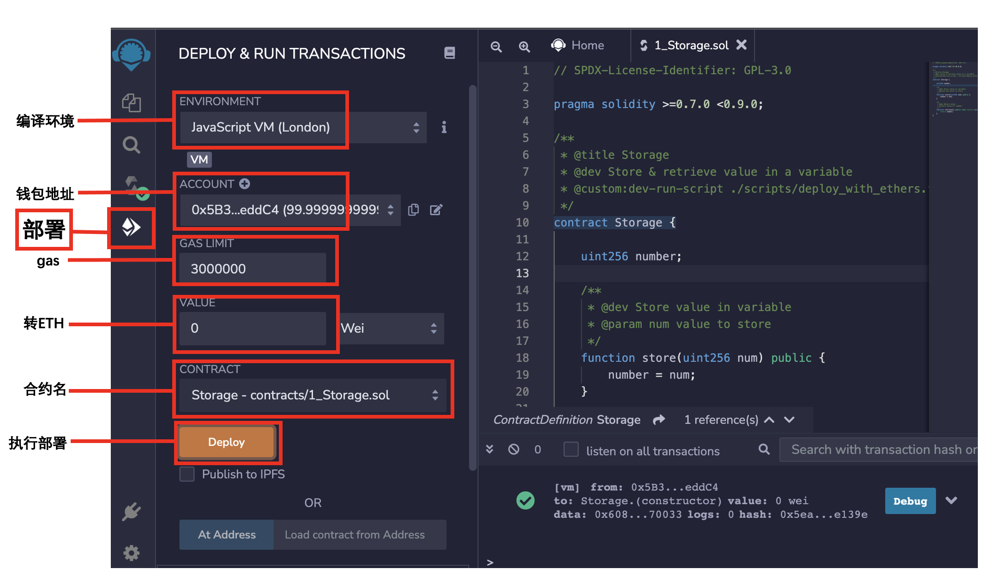
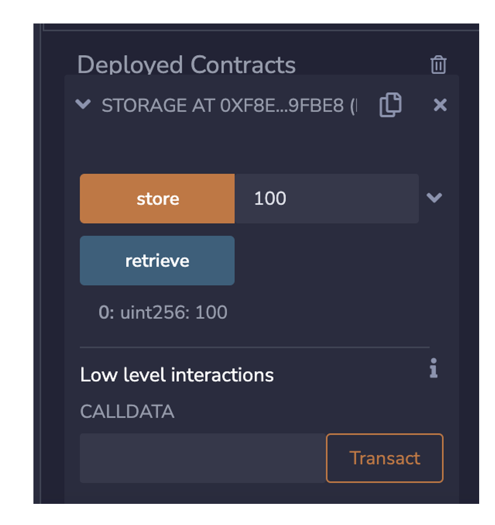

# WTF Solidity极简入门-工具篇1：Remix

我最近在重新学solidity，巩固一下细节，也写一个“WTF Solidity极简入门”，供小白们使用（编程大佬可以另找教程），每周更新1-3讲。

欢迎关注我的推特：[@0xAA_Science](https://twitter.com/0xAA_Science)

WTF技术社群discord，内有加微信群方法：[链接](https://discord.gg/5akcruXrsk)

所有代码和教程开源在github: [github.com/AmazingAng/WTFSolidity](https://github.com/AmazingAng/WTFSolidity)

-----

`Remix`是以太坊官方推荐的智能合约开发IDE，非常易用。`Remix`让你可以直接在浏览器中快速部署测试智能合约，而不需要安装配置任何程序。这一讲，我们将完整的介绍如何使用`Remix`部署合约，并调用其中的函数。

**Remix官网**：[remix.ethereum.org](https://remix.ethereum.org)

## 1.打开Remix

打开官网进入`Remix`，我们可以看到Remix由四个面板组成：
1. 图标面板：上面有代表不同功能的图标，点击后，相应的功能个会显示在侧面版上。
2. 侧面版：各种功能的 `GUI`。
3. 主面板：代码编辑器。
4. 终端：将显示与 `GUI` 交互的结果，也可以在此处运行脚本。

## 2. 图标面板

图标面板默认有4个图标，其中`文件`，`编译`，`部署`是最常用的。在你添加更多的`remix`插件后，它们也会显示在图标面板上。

## 3. 部署简单合约
### i. 选择合约文件
首先点击`文件`图标，侧面版会变为`文件浏览器`。

我们可以在`文件浏览器`中管理我们的workspace，文件夹和文件。

在`contract`文件夹下面，有三个`remix`自带的合约例子，分别是`1_Storage.sol`, `2_Owner.sol`和`3_Ballot.sol`。

点击`1_Storage.sol`，代码会显示在主面板的代码编辑器上。这个合约非常简单：它一个状态变量`number`，在链上存储一个`uint256`类型的数字；它有两个函数，`store()`函数将一个数字赋值给`number`变量；`retrieve()`展示`number`变量的数值。

### ii. 编译
接下来，点击`编译`图标，进入`Solidity Compiler`。在这里，我们选择`Solidity 0.8.7`版本，然后点击`Compile 1_Storage.sol`按钮进行编译。在合约成功编译后，`编译`图标上会显示绿色对勾。

你也可以尝试在优化中选在优化（`Enable Optimization`），次数设置为`200`，有时会省`gas`消耗。

### iii. 部署
下一步，我们要把编译好的合约部署到本地虚拟机或链上。首先点击`部署`，进入部署界面。

在`ENVIRONMENT`中，我们可以选择我们部署的环境，默认的是`JavaScript VM`，所有交易都在本地浏览器的沙盒区块链中执行，使用的是它给你的虚拟钱包地址；你也可以选择`Injected Web3`，即连接你的`metamask`钱包，所有交易会在真实的区块链中执行。

这里，我们选择`JavaScript VM`，你可以在钱包地址（`ACCOUNT`）栏看到虚拟机给你分配的测试地址。不需要调整`Gas`，也不用往合约里发送`ETH`。在`CONTRACT`栏中选择你要部署的合约`Storage`。`1_Storage.sol`文件中只有一个合约，因此默认就是部署它；但当文件包含多个合约时，我们需要手动选择要部署的合约。

点击`DEPLOY`键，部署完毕！

**注意**：如果我们选择的是`Injected Web3`来部署合约，每一笔交易都将上链，需要钱包确认交易并支付`gas`。

### iv. 调用
在合约部署成功后，我们可以在`Deployed Contracts`中找到我们部署的合约`Storage`。展开它，我们将看到所有的外部函数：`store`和`retrieve`。

我们在`store`函数那行的文本框中输入`100`，并点击函数名调用它。调用成功后，我们可以在终端上看到`log`信息，点击`Debug`按钮可以查看交易详情。

之后，我们调用`retrieve`函数，显示`number`变量被成功更新为`100`。

## 总结

这一讲，我们介绍了如何使用`Remix`编译，部署并调用智能合约。

